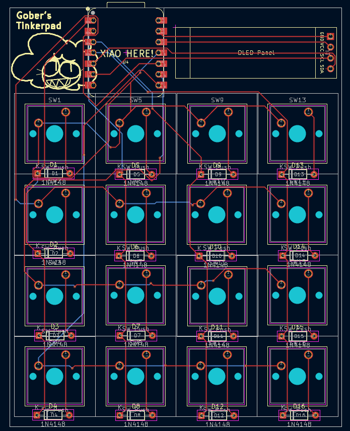
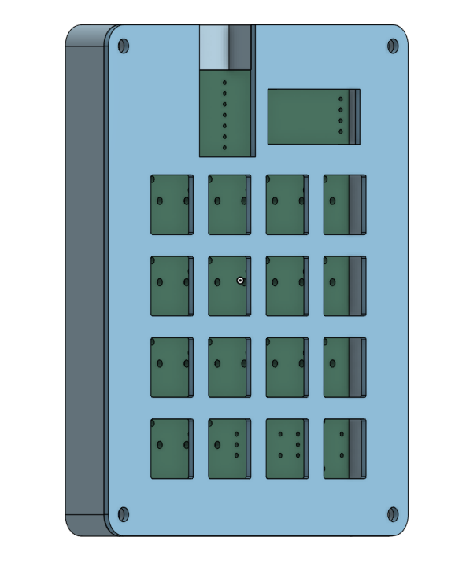

# Gober's Tinkerpad
My Hackpad submission!

# About
This is my first hardware project, and it took me WEEKS to finish because I had absolutely no idea what I was doing. I had to restart so many times I almost gave up, but here we are!
# Schematic
I got a bit of help from my friend setting up the schematic. I wanted a LOT of buttons, and I had no idea how to make a matrix. it all worked out (hopefully!)

# PCB
The PCB is sort of crowded since I designed a case for my first attempt and had to restart multiple times. I didn't want to redo the case.

# CAD
Here is the case for the macropad. I used Onshape to model it. You can open the Onshape link [here!](https://cad.onshape.com/documents/7796dfcd00a07795a78ec31b/w/0ed4cf9bd7f3ab11e0fad6be/e/e728a85e1773e941bd02e0bb?renderMode=0&uiState=6990dc6ff47d5361c8731e43)

# Firmware
I used kmk for the firmware. The oled displays what mode you're using when you change it, and any other buttons show a silly Gober face. There is also an idle animation.

# BOM
Materials I used:
- 16x Cherry MX switches
- 1x 0.91 inch OLED display
- 1x Xiao RP2040
- 16x 1N4148 Diodes
- 1x 3D printed case

# Credits
Thanks to [Thegreatmewer](https://github.com/Thegreatmewer), [this video by Digikey](https://youtu.be/WU59DkI3BpQ), and the Hack Club Slack for helping me out!
